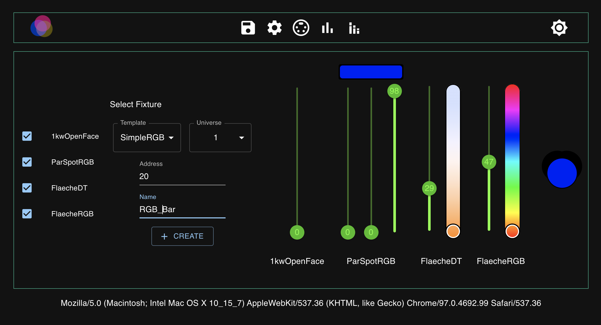
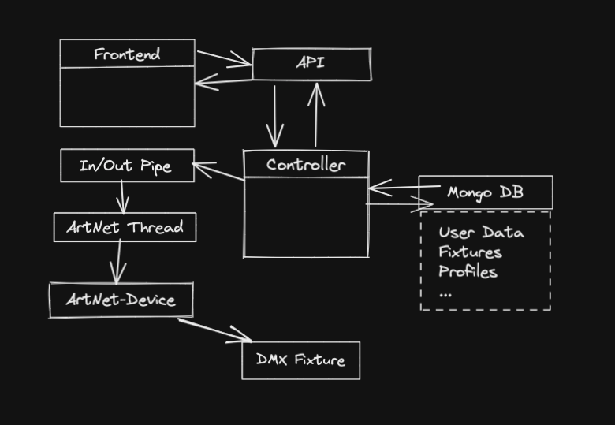

# Wires Light Controller 
(WiLiCo)(WLC)

## Ist

 - Steuerung über iPad App.
   - iPad App kann nur von einem gleichzeitig Benutzt werden
   - Akku gerne mal leer
   - Einrichtung am kleinem Bildschirm fummelig

 - Stationärem Pult
   - Kann nur über Funkanweisungen bedient werden
   - Eine Person am Pult verhaftet
   - Teuer und unflexibel

## Soll
 - Kann mit verschiedenen Devices genutzt werden  
 - Schneller Zugriff auf Funktionen mit Handy egal wo man ist.
 - Kann gleichzeitig genutzt werden
   - Einer bedient das Set mit einem Pad
   - Jemand kann mit Handy Szenen Starten
   - Ein anderer kann mit Pad oder Laptop das nächste Set vorbereiten.

## Überblick
Digitales Lichtpult das als Server läuft und über ArtNet ins DMX-Netz einspeist.
Kann dann von mehreren Anwendern gleichzeitig genutzt und administriert werden, die Irgendwo in Set oder Rigg rumhängen.

Ansteuerung über react App, eventuell auch frontend auf dem lokalen Server selbst.
Einstellungen und Szenen inMongoDB Speichern

# Wochenübersicht

## Plan
### Woche 1:
 - Deployment
 - Backend mit Artnet Anbindung
 - API empfängt und sendet einen DMX Befehl
 - Frontend empfängt und sendet einen DMX Befehl
 - Tests Schreiben

### Woche 2:
 - Sauberer Service zwischen Artnet und API
 - API und Frontend mit größerem Funktionsumfang
 - Letzter Status wird inDB gespeichert und geladen
 - Tests Schreiben

### Woche 3:
 - Szenen in DB laden und Speichern
 - Szenen in API und Frontend implementieren
 - Security mit Login
 - Tests Schreiben

### X vor 4:
 - Anpassungen an Bildschirmgrößen
 - Multi DMX Kanal befehle (RGB, Temperatur, … )
 - Fixture control
 - Profile auf DB Speichern

### Woche 4:
 - Schöner machen
 - Fehlerbehebung, wenn nötig
 - Video / Presentation

##Done
### Woche 1:
- Deployment
- Backend mit Artnet Anbindung
- API empfängt DMX Befehle
- Frontend empfängt und sendet DMX Befehle und Fader informationen
- Tests
